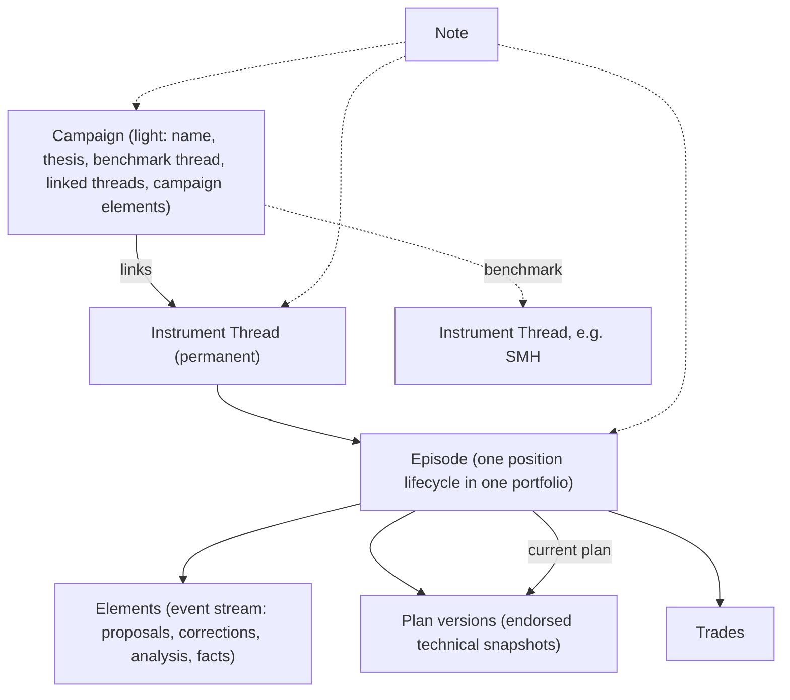

# Phase 3 Product Design: Instrument Thread Model

Date: 2026-09-21
Status: draft for review, revised 2026-09-22 after replaying the model against the real August–September counterpart history and after the counterpart's own review of the draft. Two areas are explicitly open (see [Open Items](#open-items)).

## Purpose

This document is the product design for Phase 3 of [roadmap.md](../product/roadmap.md): building the instrument thread model under a check-in ritual that now has evidence.

It records what the Phase 2 probe taught, how that changes the target model described in [instrument-threads.md](../product/instrument-threads.md), and what Phase 3 builds as a result. Once the model is implemented, the evergreen docs are updated per roadmap item 3.6 and this document becomes historical.

Use [glossary.md](../product/glossary.md) for term meanings. Decisions settled here are recorded in [decision-log.md](../product/decision-log.md) under 2026-09-21.

## What The Probe Taught

The Phase 2 probe (a Discord counterpart with system-initiated check-ins over nightly IBKR data) is going well. Jackson's assessment on 2026-09-21:

- The ritual has stuck across real workweeks.
- More than 80% of interactions pay off immediately. The reason is that planning now happens with the counterpart before execution, so when a fill arrives the bookkeeping is trivial: the trade was already discussed.
- The remaining cost is time per trade. The per-trade workflow is still converging.
- The finer details of individual plans are becoming easy to lose as the number of instruments and ideas under discussion grows. Reconstructing the current plan means rereading the conversation.
- Campaign-shaped thinking is happening (a list of semiconductor trades worked as a group) but the counterpart has no campaign object to read or write, so it is invisible to the system.

The counterpart's own list of friction points (2026-09-21) sorted against the target model:

| Counterpart suggestion | Reading |
| --- | --- |
| A current summary per instrument with separate decision history, currently hand-rolled in a Google Doc | The instrument thread, built in the wrong place because the product does not have one yet. Strongest validation the probe produced. |
| Structured working plans with proposed / agreed / superseded states, user rationale distinguished from AI analysis, and a current-plan view linking back to notes | Refines the episode: a live plan is a set of decisions with differing finality, not a form of fixed fields. |
| A reusable scenario calculator | An episode tool. Inputs are plan elements plus a valuation snapshot; outputs are proposed elements. Defined once the workflow settles. |
| A trustworthy portfolio valuation snapshot with freshness and completeness flags | Phase 1 deposit-engine debt that blocks sizing inside an episode. Pulled in as a prerequisite. |
| Active versus resolved reconciliation issues | Phase 1 debt that makes the briefing noisy. Pulled in as a prerequisite. |
| A compact read-only chart-analysis tool | Feeds Phase 4 highlighting. Out of Phase 3. |
| A readable strategy document with a publication step | Superseded by the app read surface. The Doc goes away rather than being published to. |

The counterpart's closing boundary, that improvements should reduce bookkeeping and never turn conversations into mandatory forms, is principle 14 restated from the AI side and is adopted as a design constraint below.

## Evidence: Replaying The Model Against Real Conversations

On 2026-09-21 the design was tested against a full export of the counterpart's Discord history (Aug 24 – Sep 21, 2026, about 3,900 message rows) rather than invented examples. NVDA, MU, SNDK, and BE were reconstructed turn by turn and rendered as data in the proposed model. The rendered exhibit lives outside the repository as a project artifact (`phase-3-model-walkthrough-september-2026.md`) because it carries real prices and positions.

What held:

- Threads as permanent memory. Every re-entry conversation reused prior numbers and needed prior context. On 2026-09-21 Jackson recalled the MU stop as $885; the counterpart corrected it to $875 from stored notes.
- Episodes as one position lifecycle in one portfolio. All four September engagements had clean boundaries. Pre-counterpart MU fills split across Swing and Bravos confirm that concurrent episodes correspond to different portfolios.
- Author on every element. The counterpart already refused to store its own proposals as Jackson's decisions, repeatedly and correctly.
- The read surface. Jackson, 2026-09-08: "I dont have any UI in trade-tracker yet to surface these notes or this kind of planning." The Google Doc exists because of that sentence.
- Bare episodes are the common case, not an edge: every pre-counterpart position and every non-campaign holding is one.

What had to change, each folded into the model below:

- Campaign-level rules drove the exits. MU and SNDK left under the campaign's Scenario 4 on the SMH benchmark, not their own stops. Plan elements must attach to campaigns as well as episodes, and an episode must be able to opt out of a campaign element (BE was explicitly exempted from the SMH gate).
- SMH is a real instrument used as a benchmark, not a campaign in disguise. The campaign gets a benchmark link to the SMH thread; SMH keeps its own thread.
- Facts accumulated well but never distilled. The counterpart wrote 119 notes and re-derived "the current plan" from history on request. A derived view is not enough; an authored, versioned plan snapshot is needed (see Plan below).
- The counterpart invented many hedge states ("leaning", "provisional", "illustrative", "under evaluation", "would consider"). All mapped onto four statuses without loss once `dropped` was added for elements deliberately withdrawn with nothing replacing them.
- Numeric elements need an as-of date. Stops on sloped lines drifted ($212.55 → $216.57 → $217.08 for the NVDA weekly line) and the equity denominator was frozen for fifteen days.
- Fills drive lifecycle. The three most consequential NVDA actions (an add, a stop-out, and a 20-share starter) happened outside the conversation and surfaced through broker imports. The plan was always catching up to fills, and the model must treat that as normal.

## Design Center: Read In The App, Capture In The Conversation

The first months failed because the app was the capture surface. The probe succeeds because the conversation is the capture surface. What remains for the app is reading: seeing the current plan for an instrument without rereading the conversation, and seeing every live plan at once so nothing is lost.

Phase 3 is therefore built on a split:

- The counterpart is where plans get made. Capture is exhaust of conversation.
- The app is where plans get read. Opening it is a withdrawal.

This reverses the roadmap's deferral of UI investment, but only for the new objects. Thread and episode surfaces do not exist yet and have a concrete reason to be opened. Existing campaign and trade-plan surfaces stay untouched.

Editing plan data in the app is allowed. It is a small convenience that does not make the app a capture surface, provided edits are attributed and supersede rather than overwrite, so the counterpart sees the change and its history.

## Structure Rule

Jackson's hesitation about structured data is taken seriously: structure the user had to fill in retroactively is what failed. The rule for every field in the Phase 3 model:

- If it requires the user to open a form, it is out.
- If the counterpart can populate it from what the user already said, it is in.

Two tests decide whether the structure is right, and both are cheap to adjust against:

1. Write side: does the counterpart have friction using it?
2. Read side: can Jackson open the app and find the detail he was about to lose?

Structure that passes the first and fails the second is wrong.

Counterpart guard rails, enforced by prompting rather than schema:

- The counterpart uses its judgment to fill fields and asks only when it genuinely needs an answer.
- Proposed is the default state and needs no confirmation.
- Agreed is inferred from the natural flow of conversation, as trade rationale already is. The counterpart never asks for a status.
- The counterpart never blocks on an unresolved element and never runs a checklist of unresolved fields. At a checkpoint moment it may ask one natural question for a decision-critical missing input (an exit needed for sizing, an unclear execution quantity), and it may gently steer back to an instrument that needs its checkpoint before the conversation moves on. This is conversational guidance, not a queue or a recurring reminder.

## Object Model

Six kinds of records. The episode is the container; elements and plans hang under it.

### Instrument thread

Unchanged from [instrument-threads.md](../product/instrument-threads.md): permanent, per-ticker, never closes. Aggregates episodes, notes, campaign links, and (from Phase 4) endorsed lessons.

Threads are created automatically for every ticker that has a trade or a ticker-tagged note. This covers all history, including pre-counterpart data, as bare threads with trades and no plan. Bare threads are tolerated data.

Thread notes carry the instrument-level thinking: how it behaves, what the chart structure has done over months, fundamental context. In the September history these were statements like "SNDK is much more volatile than SMH" and "NVDA has recovered from this type of breakdown before." This is where thesis-like content about an instrument lives; the plan (below) does not repeat it.

### Episode

A bounded engagement with an instrument under a thread.

Boundary rule: an episode is one position lifecycle in one portfolio, from first intent or entry to flat. Adds, trims, and alternative entry scenarios (starter now versus entry on breakout) live inside one episode. Concurrent episodes on a thread are reserved for genuinely separate engagements, such as the same ticker held in two portfolios. The real data confirmed this: prior MU fills were split across Swing and Bravos, and every September engagement was one position in Swing.

An episode carries:

- lifecycle: `Idea`, `Watching`, `Active`, `Closed`
- portfolio, which may be unknown until the first fill
- source: user-authored or external
- elements (below)
- plan versions (below) and a pointer to the current plan
- campaign exemptions: campaign elements that do not apply to this episode
- linked trades
- notes captured while live
- a retrospective when it closes (Phase 4 drafts it; Phase 3 reserves the slot)

Lifecycle is inferred, never set by the user: `Idea` on the first element, `Watching` on the first agreed entry condition or endorsed plan, `Active` on the first linked fill, `Closed` when the position is flat. Because fills often precede planning, an episode can be `Active` with no plan and no agreed elements. That is a fact the desk shows, not a warning.

An episode is valid with no elements, no plan, and no agreed anything. Bare episodes are the common case for pre-counterpart positions and non-campaign holdings.

An idea that never fills needs a way to leave the desk that is neither `Closed` nor automatic: `shelved`, set by the user in conversation or by a checkpoint that says so. Ordinary `Watching` is not owed work and must never be auto-shelved. Historical trades without portfolio attribution stay uncertain rather than forcing a guessed episode.

Reported versus verified execution stays simple. A user-reported buy or exit ("OK, exited MU and SNDK") is an `agreed` element attributed to the user; the trade record is the broker import. Lifecycle is driven by imported trades, so a reported exit shows as an agreed item until the fill arrives and the episode closes. The app does not fabricate a trade from a report, and it does not build validation machinery around the gap. Jackson: "We aren't building an accounting platform."

Closing an episode must not bury its context: its elements, plans, notes, and trades remain reachable from the thread.

### Element

The event stream of an episode (or a campaign). Elements are cheap to write, never curated by hand, and are the counterpart's exhaust from conversation. They replace the trade plan's fixed text fields.

Each element has:

- a short statement
- a status: `proposed`, `agreed`, `superseded`, or `dropped`
- an author: the user or the counterpart, so unendorsed analysis never reads as the user's plan (the two-tier memory rule from [ai-counterpart.md](../product/ai-counterpart.md) extended from lessons to plans)
- a link to the note it came from, when it came from one
- an as-of date, mandatory when the statement carries a number, because levels on sloped lines and equity denominators drift; this is the effective date and is separate from when the record was written
- an optional kind and, when a number is meaningful, a value with enough semantics to be unambiguous: unit or currency, scope (per share, position, portfolio), whether it is hypothetical, user-reported, or broker-verified, and for stops whether it is a planned exit or a reported broker order. A naked number is not enough; plain text is fine where a typed value would not be meaningful
- a revision identifier, so ordering and linking between elements and plan versions never depend on date arithmetic

Status rules learned from the real history:

- "Leaning", "tentative", and "I'm going to" are `proposed` by the user; in every observed case they resolved to `agreed` within minutes to a day.
- "Illustrative", "sensitivity", and "not adopted" are `proposed` by the counterpart.
- "Would consider, lower priority" is an `agreed` decision not to act.
- `superseded` points at the element that replaced it.
- `dropped` requires evidence of withdrawal: the user said so, or an endorsed checkpoint deliberately omitted it. Nonmention is never evidence. A target nobody has cited for weeks stays `proposed`; a deliberate wait-for-structure candidate stays `proposed`. The counterpart must not infer abandonment from silence, because that is memory-driven trading reintroduced by the tool.

Kinds are deliberately not fixed in Phase 3. The per-trade workflow is still converging. Kinds emerge from what the counterpart actually writes and are formalized when the calculator is defined.

Elements are mostly conditions and rules, not price ladders: "add only if SMH confirms and a higher support forms." The read surface should expect text with optional numbers.

### Plan

The distilled, authored snapshot of an episode's technical plan. Plans exist because the real history showed that accumulating facts is easy and distilling them is what never happened; a plan derived on the fly from elements was itself a reconstruction of something nobody had written.

A plan is an agreed checkpoint, not an always-current representation of state. That distinction was settled between Jackson and the counterpart during the counterpart's review of this draft: the plan is the distilled baseline at a decision moment; subsequent observations, decisions, and bookkeeping live as elements after it and stay visible in order. A reported fill price or a note that consolidation is developing does not regenerate the plan. A new checkpoint is written when the condensed view itself would be meaningful again.

A plan is a versioned child record of an episode, not a field on it and not a precursor to it. An episode has zero or more plan versions. Each version has:

- a version number and a revision identifier
- a `compiled through` revision: elements at or before it were considered for this checkpoint; elements after it are subsequent items, ordered by revision rather than by clock, so a backdated fill or a late-arriving import is simply an item with an earlier as-of date
- an `endorsed` flag: drafted by the counterpart, endorsed by the user in conversation or in the app
- fixed technical sections, the same every time so it reads fast:
  - entry: trigger or fill reference, price or condition
  - stop: broker backstop, discretionary level, and the rule between them
  - targets: levels with the method that produced them
  - scenarios: what to do if X, including which campaign elements apply to this episode and any exemption, so the plan is self-contained when read
  - structure: the lines and levels the plan is built on, each with an as-of date
  - size: allocation and share count
- each line cites the note or element it came from

The plan is technical only. Thesis is campaign content and thread-note content, not plan content.

Endorsing a plan is substantive agreement with its decisions, not confirmation that a summary is accurate. That holds because a plan carries only decisions: illustrative targets, alternative stops, inferred quantities, and unverified facts stay as `proposed` elements outside the plan and are never absorbed by a general "yes." Plans carry no per-line status. Anything still uncertain stays an element until a later checkpoint either absorbs or, with evidence, drops it.

The episode's latest checkpoint is its latest endorsed version. The desk and the thread page render the latest checkpoint followed by subsequent items in chronological order with their attribution and status, so a reader sees the baseline without older noise, how things have moved since, and whether cumulative divergence makes a new checkpoint worthwhile. Elements before the checkpoint are history to expand, never required reading. An active episode with no endorsed checkpoint still shows its agreed items and any unendorsed draft.

The counterpart writes a checkpoint at a clear "this is what we will do next" moment. That includes a deliberate wait or a conditional next step (enter on a breakout of $1,020; wait for structure), not only immediate execution. The mirror of a first fill on an episode with no checkpoint is one such moment. At that moment the counterpart checks that the decision-critical information for that particular plan is present, asks for what is missing if it is genuinely needed, and drafts. It uses judgment about substantial change thereafter; routine updates do not warrant regeneration or renewed endorsement. A fill-only or quantity-only update never demands re-endorsement of all six sections.

Drafting is a withdrawal: the user gets a clean plan back in the conversation and reacts in a sentence. An unendorsed draft stays a draft and never becomes owed work. The one thing to watch in the first weeks is draft quality and the counterpart's judgment about when a condensed view is due: if drafts are poor or late, they will be skipped and the desk goes stale.

The migration analogy Jackson used is the right mental model: elements are migrations, a plan version is the snapshot that compresses them, and the next migrations start from the snapshot.

### Campaign

Retained as the instrument-optional thematic layer, kept deliberately light in Phase 3:

- name and thesis
- an optional benchmark link to an instrument thread (the semiconductor campaign benchmarks SMH; SMH remains an ordinary thread that could hold an episode of its own)
- linked threads
- campaign elements: rules and scenarios that apply across the campaign's episodes (the four SMH scenarios, the de-risking ladder, the confirmation rule, the risk baseline). Same element shape as episode elements, including author, status, and as-of date.
- campaign notes for thematic thinking (the AI-tier taxonomy, campaign-level P/L)

Campaign membership is explicit at the episode level, recorded by the counterpart as exhaust. Linking a thread to a campaign does not by itself apply the campaign's rules to every episode on that thread; an old MU episode in the Bravos portfolio does not inherit the semiconductor scenarios because the MU thread is linked. Member episodes inherit campaign elements and may exempt themselves from specific ones. The derived rule set for an episode is its own agreed elements plus inherited campaign elements minus exemptions, and the plan's scenarios section writes that result down at checkpoint time. Versioned campaign rules and how exemptions carry across rule replacements are deferred with the rest of campaign depth.

Campaigns do not get plan snapshots in Phase 3. Jackson has not iterated on campaigns enough with the counterpart to know what a distilled campaign plan should hold, and campaigns were the layer that never filled out in the original app. Revisit once a few campaigns have been worked for real.

### Note

Attaches to exactly one of: a campaign, a thread, an episode, or nothing. The probe's `ticker` field on notes remains as the thread key. The existing `tradePlanId` attachment is retired with trade plans.

### Trade

Unchanged. Links to an episode instead of a trade plan. A trade with no episode is tolerated data. Lifecycle transitions are driven by trades, not by conversation.

### Trade plan

Replaced, not migrated. The fixed-field shape does not map onto elements and plan versions, and the 2026-08-04 clean slate already emptied the layer. Whether the table is removed or left dormant is an implementation decision.

## Counterpart Writes

Writing is routine. In Phase 3 the counterpart:

- creates threads (or finds the auto-created one) when a ticker is first discussed
- opens episodes on first intent or first fill
- records elements as exhaust, attributed to whoever proposed them, with as-of dates on numbers
- infers agreed from conversation, marks superseded when a decision replaces an earlier one, and marks dropped when something is clearly abandoned
- drafts plan versions at the three trigger moments and records endorsement when the user reacts
- creates light campaigns with a benchmark and linked threads when a theme is being worked, and records campaign elements and episode exemptions
- attaches notes to the right object: campaign for thematic rules and cross-instrument thinking, thread for instrument behavior and chart structure, episode for engagement-specific thoughts

All writes are legible: attributed, and superseding rather than overwriting. The counterpart's write surface is also the migration path (below).

Two contracts for the counterpart's tools, which are its primary interface to the model:

- Reads return resolved context. One episode or thread read exposes the latest checkpoint, subsequent items with status and attribution, still-open proposals regardless of age, applicable campaign rules and exemptions, linked fills, position source and freshness, and the valuation reference. The counterpart must not reassemble state across many endpoints, and bounded reads must expose truncation and allow the remainder to be fetched, so an omitted item can never be mistaken for a dropped one.
- Writes are idempotent and revision-aware. A single conceptual update may supersede several elements and draft a version in one operation; retries must not duplicate records; conflicting edits surface rather than overwrite. Actor, source, and endorser are separate: a migration agent writing on the counterpart's behalf is not user endorsement.

Guard rails carried from the structure rule: the counterpart never asks for a status, never blocks on an unresolved element, and offers a plan draft rather than requesting plan fields.

## Migration

The data worth migrating is from when the counterpart started being used (2026-08-24 onward). Earlier data is trustworthy at the trade level only.

- Threads: automatic, from tickers, all history. No user work.
- Pre-counterpart positions: bare closed or active episodes derived from trade history, one per portfolio. No elements, no plan.
- Episodes and elements for counterpart-era instruments: drafted lazily. When an instrument next comes up in a check-in, the counterpart drafts the episode and, if warranted, a first plan version from that ticker's notes, and the user reacts in conversation. There is no batch migration step and no list of instruments awaiting reconstruction.
- SMH-tagged notes from the probe split by content: campaign rules, scenarios, baselines, and P/L become campaign notes and campaign elements on the semiconductor campaign; SMH chart geometry stays on the SMH thread. The counterpart can perform that split in conversation, one campaign at a time.
- Unclear history: agents in the squadron can already talk to the counterpart and now also hold a full export of its history. An agent resolves ambiguous cases and writes through the counterpart's own write surface. No migration heuristics are built into the app. Transcript access authorizes evidence extraction, not endorsement; migrated elements keep their source links and express uncertainty where it exists. Several derived elements may cite one note that spans scopes rather than duplicating the note.

This satisfies the standing rule: no pile of owed work is created by the migration.

## Prerequisites Pulled In From Phase 1

Both are needed before the episode can pay at the moment of use.

### Trusted valuation snapshot

One portfolio valuation response with equity, cash, market value, currency, and valuation timestamp; explicit completeness and freshness flags; a clear distinction between a broker-reported valuation and a reconstructed estimate; and, when reconstructed, identification of missing or stale marks rather than silent fill. Without it, sizing inside an episode has no trustworthy denominator.

The squadron's connection to the counterpart can establish precisely which fields it cannot currently trust. The fix itself lives in the app's valuation response, since the broker-reported versus reconstructed distinction is a data-model property the counterpart cannot produce.

### Reconciliation issue state

Issues carry active versus resolved state with detected and last-rechecked timestamps. The latest attempted import is reported separately from the latest successful statement. Planning responses get a concise failure status, not a stack trace. Both are legible-automation fixes: today the system presents stale evidence as if current.

## App Read Surface

Two surfaces, kept minimal and built on the shared UI system per the roadmap principles. Both render plans, not element streams.

### Desk

Every live episode in one view, one line each: instrument, portfolio, lifecycle, position, the latest checkpoint's key lines (entry, stop, targets, active rules), and the agreed and proposed items since it. Grouped by campaign when linked, with a campaign row showing benchmark state and campaign-level rules. Episodes with a position and no endorsed plan show the position and nothing else; no warning badge. This is the answer to "which details am I losing track of."

### Thread page

For one instrument: the latest checkpoint for each live episode followed by its subsequent items in order, then history (closed and shelved episodes, their plan versions, their elements, their trades), then thread notes in chronological order. Campaign links visible. Element and plan edits are made here: attributed to the user and superseding rather than overwriting, and a user edit to a plan produces a new endorsed version.

Watchlist applies to threads, episodes, and campaigns alike and stays separate from lifecycle.

## Success Check

The counterpart's review named the main risk correctly: this design moves reconstruction from notes into a larger event stream, and the checkpoint is what prevents that from becoming a bigger pile to reread. The checkpoint only works if checkpoints actually get written at the right moments without being asked for.

The check is the one used to produce this design. After a few weeks of real use, export the counterpart's transcript and the product data, and verify against them:

- every active episode Jackson cares about carries an endorsed checkpoint he did not have to ask for
- exploration items, a next-step decision, the checkpoint, subsequent fill and chart items without regeneration, fresh-conversation retrieval, and a later substantial change prompting a new checkpoint all appear as a complete flow in both the tools and the UI
- nothing was marked dropped without evidence
- the desk answered "what is the current plan" without a reread

Then tune prompting and triggers as needed. This is a probe-style measure, not an acceptance gate; the counterpart's proposed fixture-based acceptance tests belong in the implementation plan.

## Explicitly Out Of Phase 3

- Retrospective drafting, endorsed lessons, and lesson surfacing at re-entry (Phase 4). The episode's retro slot is reserved so closing does not bury context.
- Highlighting, including approaching-condition prompts (Phase 4).
- The chart-analysis tool. Two separate issues live there: an off-network failure that looks like the counterpart reaching a LAN address instead of the Tailscale one, which is an operational bug to fix on its own, and the tool-call cost of getting the lay of the land, which wants a single summary call and belongs with Phase 4 highlighting.
- Doc publishing. Replaced by the app read surface.
- External-source episodes. The model supports them (source field); nothing populates them in Phase 3.
- Any change to existing campaign, trade-plan, import, or portfolio UI beyond what retiring trade plans requires.

## Open Items

1. **Per-trade workflow.** Jackson is converging on a repeatable set of steps per plan but judges it too early to define. It is deferred a few more days of probe use. It determines the plan element kinds and the scenario calculator's inputs and outputs. Until then, element kinds stay open and the calculator is not designed.
2. **Chart tool.** Out of scope here; needs its own boundary conversation before Phase 4, since it is the one item on the counterpart's list that could drift toward a charting replacement.
3. **Consolidation habits.** How and when old items get revisited or absorbed is left to emerge through use rather than designed now.

## Principle Check

Where the principles were tested in this design:

- Structured plans versus principle 14. Resolved by the structure rule: counterpart-populated fields only, and no status questions. Watch for the counterpart becoming an interviewer; that is the failure mode.
- Plan endorsement versus principle 14. The plan snapshot is the one new thing the user must say yes to. Accepted because the counterpart drafts it unprompted, the yes is one sentence in a conversation already happening, and Jackson has been asking the counterpart for exactly this by hand. An unendorsed draft is not debt.
- UI investment versus the roadmap's deferral. Resolved: the deferral was about surfaces that were not being opened. The new read surfaces have a reason to be opened.
- App editing versus the app becoming a capture surface again. Accepted as low risk given attribution and supersede semantics.
- Doc publishing versus Trade Tracker as authoritative. Rejected; a second copy of the plan would drift.
- Campaign depth versus principle 12 (focus over breadth). Campaigns stay light and get no plan snapshots until real use shows what they need.
- Dropping from silence versus principle 2 (reduce cognitive load) and principle 3 (preserve evidence). Inferring abandonment from nonmention would have the tool forget on the user's behalf. Rejected; dropped requires evidence.
- Execution verification versus principle 7 (minimize administrative work). Reported and imported execution are kept as an element and a trade with no reconciliation machinery between them.
- Chart tool versus the charting-replacement boundary. Deferred with the boundary flagged.

## Sequencing Within Phase 3

1. Valuation snapshot and reconciliation issue state.
2. Threads, episodes, elements, plan versions, light campaigns with benchmark links and campaign elements, episode exemptions, and the counterpart write surface. Auto-create threads and bare episodes from trade history.
3. Plan drafting at the three trigger moments; lazy episode drafting in check-ins; squadron-driven migration of counterpart-era history including the SMH note split.
4. Desk and thread page rendering plans plus deltas, with element and plan editing.
5. Define element kinds and the calculator once the per-trade workflow is settled.
6. Update the evergreen docs to describe the implemented model (roadmap item 3.6).
