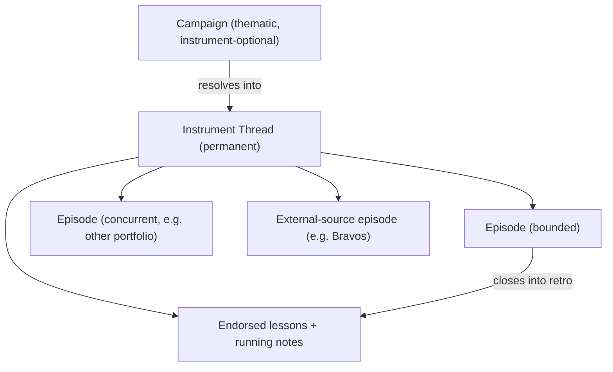

# Instrument Threads And Episodes

## Purpose

This document defines the target data model direction: instrument threads, episodes, and how campaigns relate to them.

Use it when designing or changing how ideas, setups, trades, notes, and lessons relate to each other.

This is a direction document. The current implemented model is described in [information-architecture.md](information-architecture.md); this document describes where that model is intended to go and why. Migration should follow evidence from the flywheel probe (see [roadmap.md](roadmap.md)), not precede it.

Use [glossary.md](glossary.md) for term definitions and [ai-counterpart.md](ai-counterpart.md) for the conversational layer that reads and writes this model.

## Why The Model Is Changing

The current chain is `Campaign -> Trade Plan -> Trade`, with the instrument as a field on the trade plan. In practice this shape fights how trading actually evolves:

- Trades flow between theses as markets shift, forcing constant re-filing.
- Successive plans on the same instrument start blank. When a plan closes, its context is buried with it, and the next engagement with that instrument begins from nothing.
- The one thing always known at the moment of capture is the ticker. A fill, a quick thought, or a spoken rationale can always be attached to an instrument immediately; picking the right plan among possibly stale plans is a disambiguation chore that becomes owed homework.
- Retrospectives had no consumer. Nothing ever read a finished retro, so writing one was pure deposit and they did not get written.

The fix is to make the instrument a first-class object with a permanent memory, while keeping the thematic layer that lets ideas form before any instrument is chosen.

## Target Object Model

Three kinds of objects, distinguished by lifespan:

| Object | Lifespan | Role |
| --- | --- | --- |
| Campaign | As long as the theme is relevant | Thematic idea, instrument-optional |
| Instrument Thread | Permanent | Per-instrument spine and memory |
| Episode | Bounded | One engagement: setup, execution, retro |

## Instrument Thread

A permanent per-instrument container. It never closes.

A thread aggregates:

- running notes about the instrument over time
- the accumulated read on how the instrument behaves (for example, "tends to follow rigid price action")
- endorsed lessons, including lessons about the target user's own behavior with the instrument (for example, "I chase this one")
- links to every episode, the user's own and external
- links to campaigns the instrument participates in

The thread is what makes context survive between engagements. When the target user returns to an instrument after months away, the thread is what the counterpart draws on: what happened in previous trades, what the linked campaigns implied, and what the user has learned about both the instrument and themselves.

## Episode

A bounded engagement with an instrument, born into a thread.

An episode holds:

- setup conditions: entry, target, stop, required macro conditions
- lifecycle: `idea` → `watching` → `active` → `closed`
- the notes captured while it was live
- linked trades
- a retrospective when it closes

Rules:

- A thread may have multiple live episodes at once. Genuinely distinct concurrent engagements happen in practice — for example, a short-term swing in one portfolio alongside a longer-term hold in another.
- An episode carries a source. Most are authored by the target user. External-source episodes (for example, trades from a followed recommendation service) may attach to a thread as context, even for instruments the user is not trading. External context enriches the thread without masquerading as the user's own planning.
- When an episode closes, it dies into the thread's memory: its retro conclusions become candidate lessons, and its history remains reachable from the thread. Closing an episode must not bury its context.

The episode is roughly today's trade plan, reparented under the instrument thread instead of floating beside the campaign, and given an explicit afterlife.

## Campaigns In This Model

Campaigns keep their original job: organizing ideas that form without an instrument ("investigate industrials because of X, Y, Z").

Ideas are born in two ways, and the model honors both:

- Theme-first: a campaign forms with no instrument, then resolves downward by linking to instrument threads or specific episodes as research concretizes.
- Instrument-first: a thread or episode forms with no grand theme ("watching for a bottom in AMD"), and may later link upward into a campaign, or never.

Neither direction is an exception. The model must not collapse into instrument-only.

## Notes In This Model

A note attaches to exactly one of:

- a campaign (thematic thought)
- an instrument thread (ticker-specific thought, no live episode required)
- an episode (thought about a specific engagement)
- nothing (general note)

The important change from the current model: a ticker-specific thought always has a home, without forcing a plan into existence just to hold a sentence.

## The Retro Loop

The reason retros exist in this model is that something finally consumes them:

1. An episode closes.
2. The counterpart drafts the retro from trades and captured reasoning; the target user reacts and corrects it.
3. Conclusions the user endorses become lessons on the instrument thread.
4. The next time an entry decision approaches on that instrument, the counterpart surfaces those lessons.

The withdrawal for doing a retro is a smarter counterpart at the next decision. This closes the loop that never closed before: review now feeds forward instead of terminating in a document nobody reads.

## Relationship To The Current Model

- Trades are unchanged: trustworthy execution records, linked to episodes instead of trade plans.
- Trade plans map conceptually to episodes. Whether the object is migrated or replaced is an implementation decision, made after the flywheel probe provides evidence.
- Portfolios remain overlays, attached through trades. Concurrent episodes on one thread will often correspond to different portfolios.
- Watchlist remains a cross-cutting focus layer, separate from lifecycle, and should apply to threads, episodes, and campaigns alike.
- Bare records stay tolerated data. A trade with no episode, a thread with no campaign, and an episode with no retro are all valid. Nothing in this model may become a pile of owed assignment work.

## Summary

The instrument thread is the permanent spine: per-ticker memory that aggregates episodes, notes, external context, and endorsed lessons. Episodes are bounded engagements that are born into a thread and die into its memory. Campaigns remain the instrument-optional thematic layer above. The shape exists so that capture always has an immediate home, context survives between engagements, and retrospectives feed the next decision instead of the archive.
